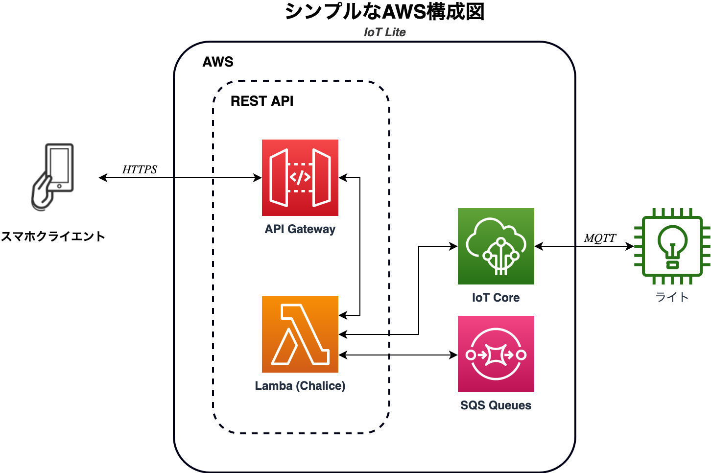

# IoTLite (POC)

The Lite Solution for AWS IoT Core driven lights. Packaged version requires 0 additional dependencies.

LEDライトの操作(IoT)用サーバーレスREST APIです。

## 課題のまとめ
ある顧客がLEDライトをスマホから遠隔制御できるアプリを開発します。アプリまたはデバイス側の開発は別のベンダーで対応します。こちらで、バックエンド開発を提供します。

### 顧客要件
- スマホアプリとLEDライト（デバイス）の間、コマンド受けるシステムを開発
  - スマホでコマンド送信 -> 作るバックエンドが受けてデバイスに送信 -> デバイスが受けて、点灯・消灯

- 対応するコマンド
  - ライトの点灯・消灯

- その他
  - SwitchでOFFになる可能性があるので、スマホアプリからLEDライトの接続性を確認するための機能
    - リアルタイム性は要求されず、数分程度の遅延で良い
  - スマホ・ライト側に開発するベンダーのため、インターフェース仕様書

## 実装
AWSのサーバーレスAPIを簡単にdeployするために[AWS Chalice](https://aws.github.io/chalice/)というframeworkを使います。Chaliceで開発スピードも速いです。Chaliceで様々な延長機能もあります。例えば、[SDK](https://aws.github.io/chalice/topics/sdks.html)なども自動的に生成できます。これで、バックエンドがスムーズに成長できると思います。

### 構成図
<p align="center">
  
</p>

その他
- [接続性リクエストの流れ](availability.png)
- [コマンドリクエストの流れ](command.png)

### 条件
- AWS
  - API Gateway
  - IoT Core
  - Lambda
  - SQS
- Python 3.8+

### 機能

- ライト管理
  - 登録（クライアント証明書など）
  - 削除
  - 一覧・一台の情報
    - デバイスの接続性
- ライトとの通信
  - MQTTでほぼリアルタイムな双方向通信は可能
  - それぞれのライトが自分のトピックだけにセキュアにPub/Subするのは可能
    - 遠隔制御用：　`<device_id>/command`にライトがSubできる
    - データ通信： `<device_id>/data`にライトがPubできる
    - `lightPolicy`を編集でトピックを簡単に追加できる
- 遠隔制御
  - ライトの`command`MQTTトピックにコマンドを送信するのは可能

### 開発ノート

#### AWSにDeploy

まずはlocalでAWSのSDKやCLI Credentialsを設定してください。様々な設定仕方があるんですが、`~/.aws/config`でやるのはおすすめです。詳しくは[こちら](https://aws.github.io/chalice/quickstart.html#credentials)です。

デプロイメントには2つの部分があります。基盤のインフラとREST API

##### 1. 基盤のインフラ

基盤のインフラは、CloudFormationスタックでdeployします。CLIまたはAWSコンソールのGUIを介して、`CloudFormation.yaml`のテンプレートファイルをアップロードしてスタックを作成します。

REST APIの設定で必要なので、「Output」値を手元に置いておいてください。

##### 2. REST API

chaliceで、一つのCloudFormation packageを生成できますが、`chalice deploy`の色々な機能が使えないようになります。Convenienceのため、REST APIが他のインフラから別でchaliceの力でdeployします。

まず、PythonのVENVを作ってactivateします。3.8で作ってください。

```
python3 -m venv venv
. /bin/activate
```

次、このリポジトリをクローンして、`cd`でフォルダーに入ります。

```
git clone git@github.com:Phamiliarize/IoTLite.git
cd IoTLite
```

次、AWSのchaliceやpytestなどをインストールします。後、`help`でインストールしたことを確認できます。

```
pip install -r venvRequirements.txt
chalice --help
```

REST APIをAWSに`chalice deploy`でdeployします。

```
$ chalice deploy
...
Resources deployed:
  - Lambda ARN: arn:aws:lambda:ap-northeast-1:12345:function:IoTLite-dev
  - Rest API URL: https://abcd.execute-api.ap-northeast-1.amazonaws.com/api/
```

調査が終わってから、作ったリソースが`chalice delete`で簡単に消せます。

```
$ chalice delete
Deleting Rest API: IoTLite-dev
...
```

CloudFormationのスタックは、CloudFormationの方で消せます。

#### ユニットテスト

ユニットテストのため、pytestを使います。venvにpytestを`pip install pytest`でインストールしてください。
それで、`pytest`のコマンドでテストを実行できます。

```
$ pytest
============================================================= test session starts =============================================================
platform darwin -- Python 3.9.1, pytest-6.2.4, py-1.10.0, pluggy-0.13.1
rootdir: /Users/user/CMIoT/IoTLite
collected 1 item                                                                                                                              

tests/test_app.py .                                                                                                                     [100%]

============================================================== 1 passed in 0.39s ==============================================================
```

テストの書き方について、詳しくは[こちら](https://aws.github.io/chalice/topics/testing.html)です。


#### インターフェース仕様書

スマホアプリやウェブアプリなどがREST APIにHTTPリクエストで様々な機能を使えます。
- [REST API仕様書](https://docs.google.com/document/d/1fnjy7iLFiI1Ft5a_Mmju6QddofU-WDel18-SHy0zIek/edit?usp=sharing)

ライト(デバイス）側で、クライアント証明書認証でMQTTトピックに接続して、データを通信できます。
- [MQTT仕様書](https://docs.google.com/document/d/1jazI5Go3qY8vfn5BJwxOZe2O8fKrb4ZMOFMKz2UryVw/edit?usp=sharing)

#### 将来の延長
- 今回、ユーザ認証システムが顧客要件に入れていないので、実装しないですが、することになったら、Chaliceで簡単に[Cognito Userpool](https://aws.github.io/chalice/topics/authorizers.html#amazon-cognito-user-pools)を統合するできます。実装することをおすすめです。
  - Cognitoを実装の後のステップは、デバイスレベルかグループレベルのアクセス権限
- 新しいコマンドが自由にCOMMANDSのdictionaryに追加できます。
- Shadowを使ったら、電源オフの時にもコマンド受けることが対応できるようになります。接続してから、Shadowからステートを更新
- Edge caseのテストを増える