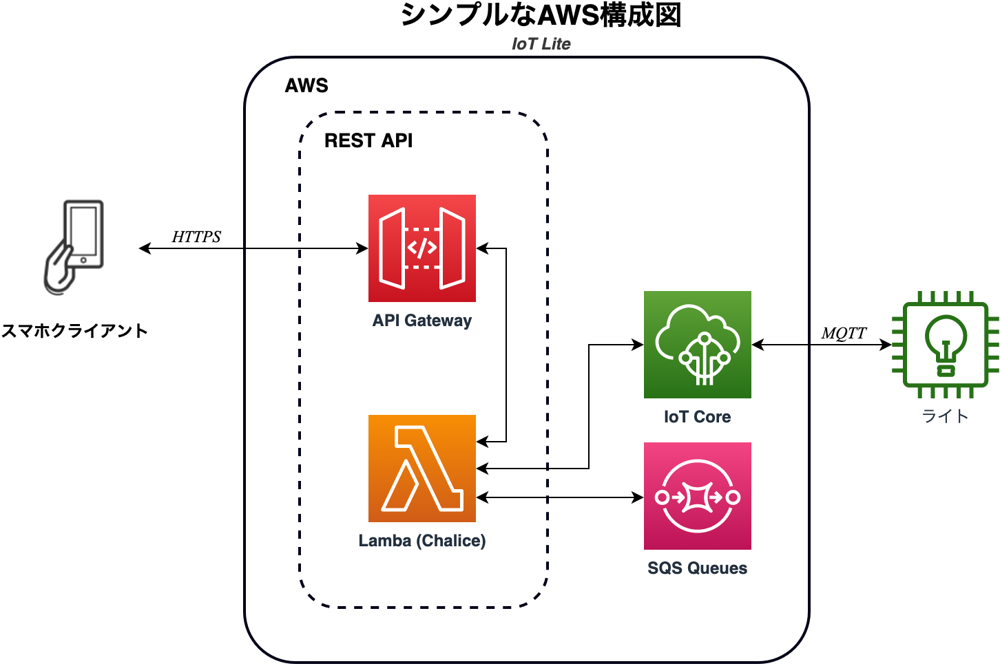

# IoTLite

The Lite Solution for AWS IoT Core driven lights.

LEDライトの操作(IoT)用サーバーレスREST APIです。

## 課題のまとめ
ある顧客がLEDライトをスマホから遠隔制御できるアプリを開発します。アプリまたはデバイス側の開発は別のベンダーで対応します。こちらで、バックエンド開発を提供します。

### 顧客要件
- スマホアプリとLEDライト（デバイス）の間、コマンド受けるシステムを開発
  - スマホでコマンド送信 -> 作るバックエンドが受けてデバイスに送信 -> デバイスが受けて、点灯・消灯

- 対応するコマンド
  - ライトの点灯・消灯

- その他
  - SwitchでOFFになる可能性があるので、スマホアプリからLEDライトの接続性を確認するための機能
    - リアルタイム性は要求されず、数分程度の遅延で良い
  - スマホ・ライト側に開発するベンダーのため、インターフェース仕様書

## 実装
AWSのサーバーレスAPIを簡単にdeployするために[AWS Chalice](https://aws.github.io/chalice/)というframeworkを使います。Chaliceで開発スピードも速いです。Chaliceで様々な延長機能もあります。例えば、[SDK](https://aws.github.io/chalice/topics/sdks.html)なども自動的に生成できます。これで、バックエンドがスムーズに成長できると思います。

### 構成図

  

その他
- [接続性リクエストの流れ](availability.png)
- [コマンドリクエストの流れ](command.png)

### 条件
- AWS
  - API Gateway
  - IoT Core
  - Lambda
- Python 3.8